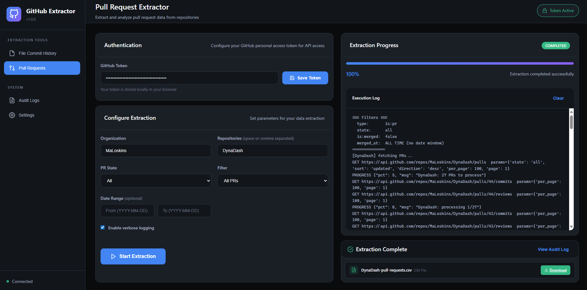
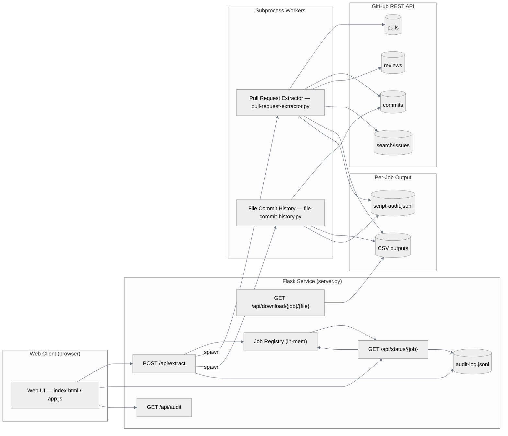
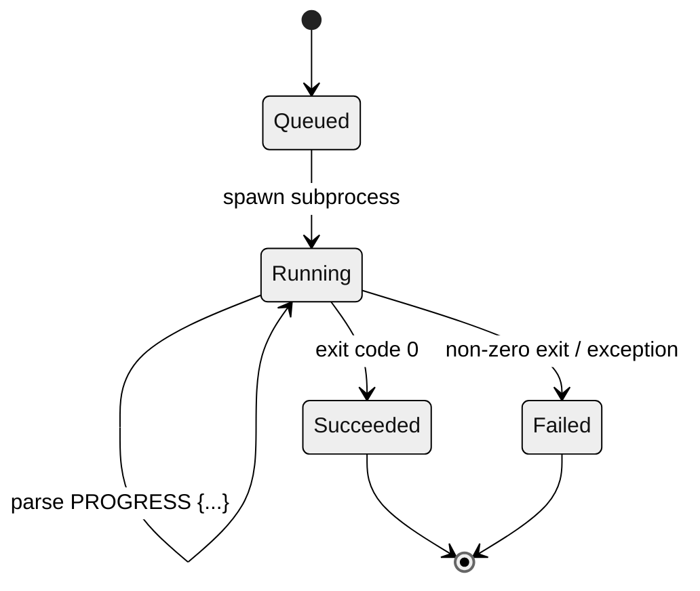
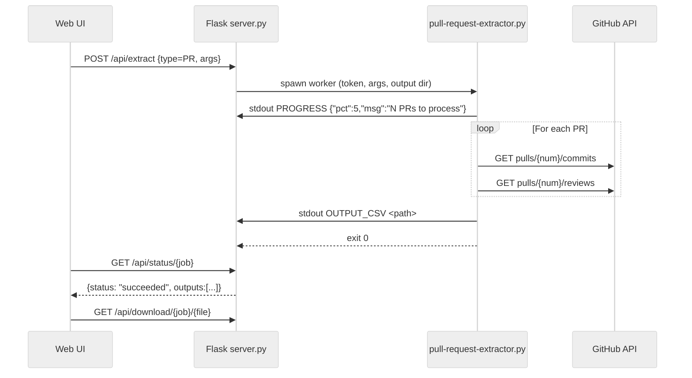
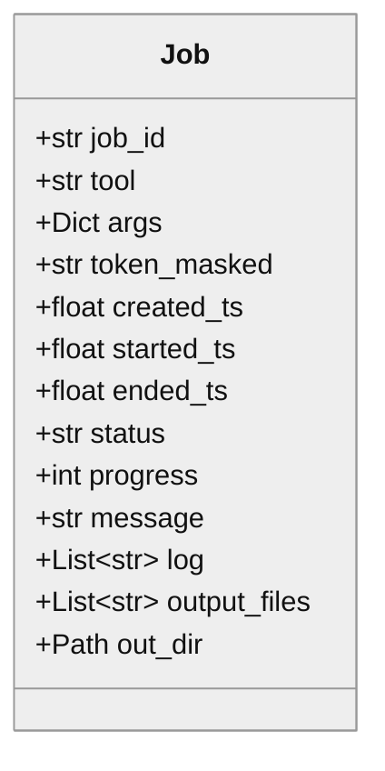

# GitHub Extraction Toolkit — README

> A lightweight, verifiable toolkit for extracting GitHub repository data (pull requests and per-file commit history), with a small web UI, progress telemetry, and an auditable execution trail.

This README is written for reviewers and stakeholders who need **traceable, repeatable evidence** that the extraction is **complete and accurate** for the specified scope. It includes architecture diagrams, data contracts, runbooks, and verification procedures.


---

## Table of Contents

1. [At a Glance](#at-a-glance)
2. [Architecture & Design](#architecture--design)
3. [Data Flow & Operations (Diagrams)](#data-flow--operations-diagrams)
4. [Installation](#installation)
5. [Configuration](#configuration)
6. [Command-Line Tools](#command-line-tools)

   * [Pull Request Extractor](#pull-request-extractor)
   * [Per-File Commit History Extractor](#per-file-commit-history-extractor)
7. [Web Service & UI](#web-service--ui)
8. [Outputs & Data Contracts](#outputs--data-contracts)
9. [Progress, Logs & Audit Trail](#progress-logs--audit-trail)
10. [Rate Limits & Performance](#rate-limits--performance)
11. [Security & Secrets](#security--secrets)
12. [Completeness & Accuracy](#completeness--accuracy)
13. [Validation Checklist](#validation-checklist)
14. [Known Limitations & Edge Cases](#known-limitations--edge-cases)
15. [Extensibility Guidelines](#extensibility-guidelines)
16. [Operational Runbook](#operational-runbook)
17. [Appendix A — CLI Reference](#appendix-a--cli-reference)
18. [Appendix B — HTTP API Reference](#appendix-b--http-api-reference)

---

## At a Glance



**Components**

* `pull-request-extractor.py` — Extracts PRs for specified repos, including counts of commits/reviews and the PR description & URL.
* `file-commit-history.py` — Extracts commit history for a **specific file path**, including per-commit file deltas.
* `server.py` — Flask service that orchestrates jobs, streams progress, stores outputs by job ID, and appends an audit log.
* `web/` — Minimal front-end to run extractions, monitor progress, and download outputs.

**Key Properties**

* **Deterministic paging** against GitHub REST API.
* **Explicit scoping** via CLI flags (date windows, merged-only, branch/SHA, path).
* **Structured outputs** (CSV) with stable schemas.
* **Progress telemetry** (stdout `PROGRESS` JSON lines) and **audit logs** (JSON lines).
* **Token masking** in audit trail.
* **All-time** coverage by default for both tools when no date window is provided.

**Directory Layout**

```
github-extractor/
├── .gitignore
├── file-commit-history.py
├── pull-request-extractor.py
├── server.py
└── web/
    ├── app.js
    ├── index.html
    └── styles.css
```

---

## Architecture & Design

* **Client**: `web/` (HTML/JS/CSS) invokes REST endpoints to start jobs and poll status.
* **Orchestrator**: `server.py` maintains an in-memory `Job` registry, spawns Python subprocesses for each extraction, parses progress lines, collects output file paths, and writes an **audit log** to `audit-log.jsonl`.
* **Workers**:

  * **PR Extractor**: calls GitHub Pulls/Commits/Reviews endpoints; optionally uses the Search API to pre-filter by merged date window.
  * **Per-File Commit History**: calls the Commits list endpoint with `path=` filter and then retrieves each commit’s detail to get per-file stats.
* **Artifacts**: One **output directory per job** under `output/<job_id>/`, containing CSVs and a script-level audit log. Server exposes a direct **download endpoint**.

---

## Data Flow & Operations (Diagrams)

### System Overview



### Job Lifecycle (Status & Progress)



### PR Extraction Sequence



---

## Installation

**Prerequisites**

* Python ≥ 3.9
* `pip` and a virtual environment recommended
* A GitHub **Personal Access Token (PAT)** with `repo` scope for private repositories if required

**Setup**

```bash
# From repository root
python -m venv .venv
. .venv/bin/activate   # Windows: .venv\Scripts\activate
pip install -U flask requests
```

---

## Configuration

* **GitHub Token** is required at runtime:

  * CLI: `--token YOUR_TOKEN`
  * or env var: `GITHUB_TOKEN`
* **Default behavior**:

  * If no date window is supplied, both tools run **for all time** (no implicit cutoff).
  * PR extractor defaults to `--merged-only` **enabled**; pass `--no-merged-only` to include non-merged PRs.
* **Server**:

  * Listens on `127.0.0.1:8000` by default (`PORT` env var optional).
  * Outputs per job under `output/<job_id>/`.

---

## Command-Line Tools

### Pull Request Extractor

**Script**: `pull-request-extractor.py`
**Purpose**: Export PRs for target repos, with commit/review counts and the PR description & URL.
**Default scope**: All time, unless you pass `--since/--until`.

**Quick Start**

```bash
python pull-request-extractor.py \
  --token $GITHUB_TOKEN \
  --org organisation \
  --repos repo-in-org1 sdk-core \
  --state closed \
  --merged-only \
  --output-dir output
```

**What it does**

* Lists PRs via `GET /repos/{org}/{repo}/pulls` and pages until exhausted.
* When a **date window** is provided *and* `--merged-only` is set, uses **Search API** to pre-filter (`merged:YYYY-MM-DD..YYYY-MM-DD`) for performance.
* For each PR, fetches commits and reviews to compute counts.
* Writes one CSV per repo.

**Notable flags**

* `--state {open|closed|all}` (default `closed`)
* `--merged-only / --no-merged-only` (default merged-only)
* `--since YYYY-MM-DD` and/or `--until YYYY-MM-DD`
* `--verbose` prints every HTTP request
* `--emit-progress` emits progress JSON to stdout (used by `server.py`)

---

### Per-File Commit History Extractor

**Script**: `file-commit-history.py`
**Purpose**: For each target repo, list **commits that touched a specific file path** and extract per-commit file deltas.
**Default scope**: All time, unless you pass `--since/--until`.

**Quick Start**

```bash
python file-commit-history.py \
  --token $GITHUB_TOKEN \
  --org organisation \
  --repos repo-in-org1 \
  --file-path .github/workflows/service-deployment.yml \
  --output-dir output
```

**What it does**

* Lists commits with `GET /repos/{org}/{repo}/commits?path=<file>`.
* Fetches each commit’s details (`/commits/{sha}`) to obtain **file-level stats**, status, and rename info.
* Writes one CSV per repo/file.

**Notable flags**

* `--file-path` **required**
* Optional `--sha` for branch or specific commit range root
* `--since / --until` for date window
* `--verbose`, `--emit-progress`, `--audit-log` (path to append script-level audit JSONL)

---

## Web Service & UI

**Script**: `server.py`
**Start**

```bash
python server.py
# Visit http://127.0.0.1:8000
```

**Capabilities**

* **Start jobs**: `POST /api/extract` with `type` = `pull-request-extractor` or `file-commit-history` and the corresponding args.
* **Track jobs**: `GET /api/status/{job_id}` returns progress, last message, tail of logs, and list of generated files.
* **Download outputs**: `GET /api/download/{job_id}/{filename}`
* **Audit view**: `GET /api/audit` returns the last 100 audit entries.

**UI Highlights (`web/`)**

* Token is stored **locally in the browser**.
* Form builders for each tool (org, repos, date window, etc.).
* Real-time progress bar & log tail.
* Download cards for generated CSVs.
* Audit log modal for run history.

---

## Outputs & Data Contracts

### PR CSV (`{repo}_pull_requests.csv`)

Columns (stable order):

| column             | description                                               |
| ------------------ | --------------------------------------------------------- |
| `number`           | PR number                                                 |
| `title`            | PR title                                                  |
| `state`            | PR state (`open`/`closed`)                                |
| `created_at`       | PR creation timestamp (ISO)                               |
| `merged_at`        | Merge timestamp (if merged)                               |
| `author`           | PR author (login)                                         |
| `merge_commit_sha` | Merge commit SHA (blank if not available via search path) |
| `commits_count`    | Count of commits in PR                                    |
| `reviews_count`    | Count of submitted reviews                                |
| `description`      | Full PR body/description (may be empty)                   |
| `url`              | HTML URL to the PR                                        |

> **Note:** The **description** and **URL** fields are included for downstream traceability and context linking.

---

### Per-File Commit History CSV (`{repo}__{path}__file-history.csv`)

Columns (stable order):

| column              | description                                                                  |
| ------------------- | ---------------------------------------------------------------------------- |
| `repo`              | Repository name                                                              |
| `file_path`         | Target file path (as queried)                                                |
| `commit_sha`        | Commit SHA                                                                   |
| `html_url`          | API-provided HTML URL for commit                                             |
| `commit_url`        | Constructed URL `https://github.com/{org}/{repo}/commit/{sha}`               |
| `commit_date`       | Commit author date (ISO)                                                     |
| `author_login`      | Author login (if available)                                                  |
| `author_name`       | Author display name                                                          |
| `author_email`      | Author email (if available)                                                  |
| `committer_login`   | Committer login (if available)                                               |
| `message`           | Commit message (single-line normalized)                                      |
| `status`            | File status in this commit (`modified`, `added`, `removed`, `renamed`, etc.) |
| `previous_filename` | Previous name for renames                                                    |
| `additions`         | Lines added **for that file in the commit**                                  |
| `deletions`         | Lines deleted **for that file in the commit**                                |
| `changes`           | Total line changes **for that file in the commit**                           |

> Rows are sorted **descending by `commit_date`** for easy recent-first review.

---

## Progress, Logs & Audit Trail

**Progress (stdout)**

* Workers emit: `PROGRESS {"pct": <0-100>, "msg": "<string>"}`.
* Server parses these lines to populate status and the UI progress bar.

**Output discovery (stdout)**

* Workers emit: `OUTPUT_CSV <absolute_or_relative_path>` for each generated CSV; server registers the file for downloads.

**Audit Trail**

* `server.py` appends JSON lines to `audit-log.jsonl` for:

  * Job start (masked token, command preview, tool, args)
  * Job end (status, duration, outputs, last message, progress)
* Each worker can also append a **script-level audit** in the job folder (e.g., `script-audit.jsonl`) with rows written, duration, and parameters.

**Token Masking**

* All audit entries redact the token except the first/last 4 characters (e.g., `ghp_****...****`).

---

## Rate Limits & Performance

* **Pagination**: Both tools fetch `per_page=100` and loop until fewer than 100 items are returned.
* **Backoff**: On `403` with `X-RateLimit-Remaining: 0`, workers **sleep until reset** and retry the request automatically.
* **Search API Cap**: When using the PR Search optimization path, GitHub may cap results (\~1000). Use **date windows** to segment large ranges and avoid truncation. The non-search path (listing pulls) is used when no window is specified or `--no-merged-only` is used.
* **Throughput Tips**

  * Reduce date spans or split by month/quarter.
  * Limit repositories per run.
  * Avoid `--verbose` for faster console I/O.

---

## Security & Secrets

* Tokens are provided **per run** (CLI or UI).
* The UI stores the token **only in localStorage** on the user’s machine.
* The server **does not persist** the token in plaintext logs; it’s masked in audit records.
* Outputs and per-job audit files are written under `output/<job_id>/`.

---

## Completeness & Accuracy

This section defines what “complete and accurate” means for this toolkit and prescribes **controls** to demonstrate it.

### Definitions

* **Completeness**
  Given a defined scope `(org, repos[], filters)`, **every** item from the source API that matches the filter **is present** in the output without unintended omissions:

  * PR extractor: all PRs matching state and (if applicable) merge window; when merged-only is used, only merged PRs are included.
  * File history: all commits that **touched the specified file path**, within the date window (or all time if none).

* **Accuracy**
  For each included item, the **field values** in the CSV **faithfully represent** the source API fields, with transformations limited to safe normalizations (e.g., trimming, date parsing, newline normalization in messages) and deterministic URL construction.

### Design Controls

1. **Deterministic Paging**: `get_all` loops with `per_page=100` until exhaustion, preventing silent truncation for REST list endpoints.
2. **Window Semantics**: If `--since/--until` are omitted, both tools operate **for all time** (no implicit cutoffs).
3. **File Scoping**: Commit history requests include `path=<file>`, guaranteeing the server filters at source.
4. **Positive Identification**: PRs and commits are referenced by canonical IDs (`number`, `sha`).
5. **Atomic Output Signalling**: Workers log `OUTPUT_CSV` only after successful write.
6. **Rate-Limit Handling**: Automatic sleep/retry eliminates partial results due to quota mid-run.
7. **Token Redaction**: Prevents leakage of credentials in evidentiary logs.

### Procedural Controls

**C1 — Record Count Reconciliation**

* For PRs:

  * Compare the CSV **row count** to the GitHub UI count for the same filters or to paged API totals.
  * If using the Search API path (merged-only + window), segment long periods (e.g., monthly) to ensure the Search cap does not truncate results.
* For File history:

  * Use `GET /commits?path=...` metadata (count via pagination) to reconcile with number of **rows** in the CSV.

**C2 — Spot-Check Field Fidelity**

* Randomly sample 5–10 rows:

  * Open the `url` (PR) or `commit_url` (commit) and verify `title`, `author`, timestamps, and counts match.
  * For file history, confirm `status/additions/deletions/changes` equal those shown in GitHub’s “Files changed” for that commit.

**C3 — Deterministic Re-Run**

* Re-run the same command with identical parameters (including date window).
  Expected: identical CSV (byte-for-byte) unless data changed at source.
  Control: compute and compare file hashes (e.g., SHA-256).

**C4 — Boundary Testing**

* Run with a **narrow window** (e.g., a single day) and verify that only items merged/committed within that window appear; then expand the window to ensure those items remain included.

**C5 — Rename/Move Validation (File history)**

* Identify a known **rename** event; verify `previous_filename` is populated on the rename commit and that subsequent commits reflect the new path.

**C6 — Negative Assurance**

* Confirm **exclusions** behave correctly:

  * `--merged-only` excludes non-merged PRs.
  * File history excludes commits that did **not** touch the path.

**C7 — Execution Evidence**

* Retain `audit-log.jsonl`, per-job `script-audit.jsonl`, and the command line used (visible in the server audit with token masked) as **evidence of parameters, timing, and outcomes**.

---

## Validation Checklist

* [ ] Scope documented: `org`, `repos`, tool(s), date window, flags.
* [ ] Token provenance recorded (who provided, where stored).
* [ ] Run parameters captured in audit logs.
* [ ] Row counts reconciled to API/UI for the same filters.
* [ ] Sampled rows match source fields and pages.
* [ ] Boundary windows tested (narrow vs expanded).
* [ ] Rename cases validated (file history only).
* [ ] Search API segments applied when needed to avoid caps.
* [ ] Re-run determinism confirmed (hash match).
* [ ] Artifacts archived (CSV + audit logs) with retention location.

---

## Known Limitations & Edge Cases

* **Search API ceiling**: When using the optimized merged-window path, results may cap (\~1000). Mitigate by splitting windows.
* **PR merge SHA**: In the Search path, `merge_commit_sha` may be blank unless you perform an additional PR details fetch (not strictly required for current outputs).
* **Time Zones**: Date parsing normalizes simple `YYYY-MM-DD` inputs to UTC ISO. Source timestamps are as returned by GitHub (ISO 8601).
* **Large Histories**: Very large repositories or long timeframes can be slow; consider splitting by quarters/months.
* **Private Repos**: Require a token with sufficient scopes.

---

## Extensibility Guidelines

* **Add a New Extractor**: Follow the pattern: `get_all` pagination, `--emit-progress`, `OUTPUT_CSV` line, and a stable CSV schema.
* **New Columns**: Append to the end of the CSV header; avoid reordering existing columns to preserve downstream compatibility.
* **Server Integration**: Register a new `type` in `/api/extract`, map args to flags, and ensure token masking.
* **UI Form**: Add a form config block in `web/app.js` (`FORMS` registry) and relevant inputs.

---

## Operational Runbook

* **Start server**: `python server.py`, open `http://127.0.0.1:8000`.
* **Set token** in UI “Authentication”.
* **Configure extraction** in the form (repos separated by space or comma).
* **Run** and monitor progress/logs; download CSVs when complete.
* **Troubleshooting**

  * **403 rate limit**: The worker will sleep until reset; no action required except patience.
  * **401 unauthorized**: Verify token and repo access.
  * **Empty CSV**: Check filters (date window too strict? wrong repo or path?).
  * **Network errors**: Re-run; server will mark job failed and keep logs.

---

## Appendix A — CLI Reference

### `pull-request-extractor.py`

```
--token TOKEN                (or env GITHUB_TOKEN)
--org ORG
--repos REPO [REPO ...]      (space-separated)
--output-dir DIR             (default: output)
--since YYYY-MM-DD           (optional)
--until YYYY-MM-DD           (optional)
--state {open,closed,all}    (default: closed)
--merged-only / --no-merged-only
--verbose
--emit-progress
--audit-log PATH
```

### `file-commit-history.py`

```
--token TOKEN                (or env GITHUB_TOKEN)
--org ORG
--repos REPO [REPO ...]      (space-separated)
--file-path PATH             (required)
--output-dir DIR             (default: output)
--since YYYY-MM-DD           (optional)
--until YYYY-MM-DD           (optional)
--sha BRANCH_OR_SHA          (optional)
--verbose
--emit-progress
--audit-log PATH
```

---

## Appendix B — HTTP API Reference

### `POST /api/extract`

Start a job.

**Body**

```json
{
  "type": "pull-request-extractor",
  "token": "ghp_xxx",
  "args": {
    "org": "organisation",
    "repos": "repo-in-org1",
    "state": "closed",
    "merged_only": true,
    "since": "2025-06-01",
    "until": "2025-06-30",
    "verbose": false
  }
}
```

**Response**

```json
{ "job_id": "69ba3be5c945" }
```

### `GET /api/status/{job_id}`

Returns:

```json
{
  "job_id": "...",
  "tool": "pull-request-extractor",
  "status": "running|succeeded|failed",
  "progress": 0,
  "message": "Starting...",
  "log": ["...tail of logs..."],
  "outputs": ["repo_pull_requests.csv"]
}
```

### `GET /api/download/{job_id}/{filename}`

Downloads a generated file in the job’s output folder.

### `GET /api/audit`

Returns the last 100 audit entries as JSON lines (parsed to objects), including:

* `tool`, `args`, `token_masked`
* `status`, `duration_sec`, `outputs`, `last_message`
* `cmd_preview` (token elided)

---

## Appendix — Additional Diagram (Job Class)



---
